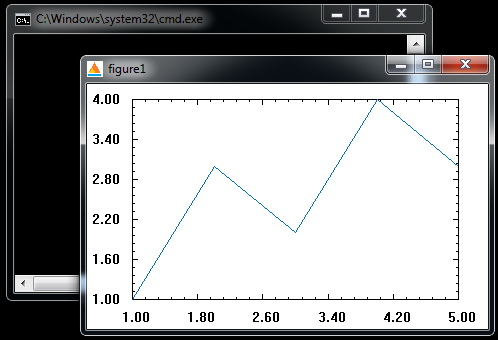
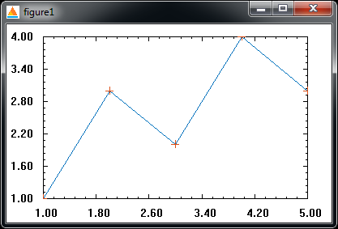
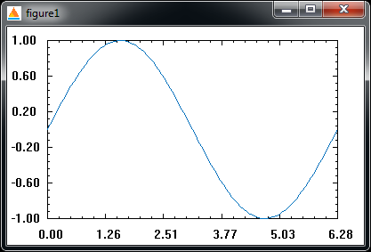
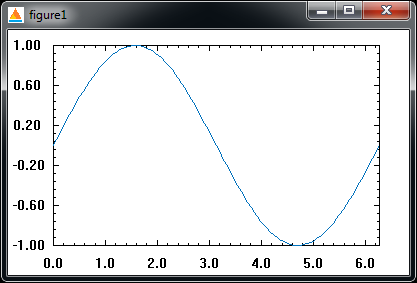

MatPlot
=======


a Visual C++ library that allows you to plot just as in Matlab.

Click [here](http://littleshi.cn/blog/MatPlot_Use/ "littleshi.com") for the Chinese page of this project. The library can be used in a Console program as well as any other Visual C++ program. To use MatPlot, you just need to include `MatPlot.h`, set the linker to input `MatPlot.lib` and copy `MatPlot.dll` to your project folder. For a detailed tutorial on how to do this in Visual Studio 2017, please read the wiki.

User's Guide
--------------

### 1. The First Example


```
#include <Windows.h>
#include <cmath>
#include "MatPlot.h"

using namespace MatPlot;
int main()
{
	double x[5]{ 1,2,3,4,5 };
	double y[5]{ 1,3,2,4,3 };
	int N{ 5 };
	MatPlotInit();
	plot(x, y, N);
	Sleep(60000);
	MatPlotClose();
	return 0;
}
```
Note that every function in MatPlot has namespace `MatPlot`. Use `MatPlotInit()` and `MatPlotClose()` to initialize and close MatPlot. They can be used only once in a program, every MatPlot function must be invoked between `MatPlotInit()` and `MatPlotClose()`. Use `Sleep()` function so that the figure does not close immediately.

`plot()` function's prototype is<br>
`plot(double *px, double *py, int N, char color = 'a');`<br>
where `px` and `py` could be array names or pointers, `N` is the number of elements in `px` and `py`, `color` is a single character indicating the color. The default value `a` means automatic, which means the color will change every time `plot()` or `scatter()` is used. Like in Matlab, the possible `color` values can be 'r'(red), 'g'(green), 'b'(blue), 'y'(yellow), 'm'(magenta), 'c'(cyan), 'k'(black), 'w'(white). `plot()` always operate on the current figure, if there is none opened yet, figure1 will be created.

`scatter()` function scatters '+' shaped data points on a figure, its prototype is the same as `figure()`, you can add the following line under `plot(...);` in the above example. <br>
`scatter(x, y, N);` <br>



Note that the color has become orange now.

`figure()` function creates new figure dialog, the prototype is<br>
`figure(int FigNo = -1);`<br>
In the default case, `figure()` will number the dialogs starting from one. If there is a positive `FigNo` input, figure dialog with number (FigNo + 1) will be generated (since C++ is 0 based). `figure()` can also be used to specify the current figure for functions such as `plot()` and `scatter()` to work on.

`close()` function closes a figure, the prototype is<br>
`close(int FigNo = -1);`<br>
In the default case, it will close the current figure. When used with an argument, it will close the (FigNo + 1)th figure. In both cases, if the current figure is closed, the current figure will become the next opened figure with a larger number, if there is none, an opened figure with a smaller number is used. Closing a figure by clicking X button is the same as using a `close()` function.

`close_all()` function closes all opened figures.

`clf()` (clean figure) function cleans the current figure, and set the axis range from 0 to 1.

`axis()` function changes the axis range, its prototype is<br>
`axis(double xmin, double xmax, double ymin, double ymax);`<br>
where the arguments are the minimum and maximum values for x and y axis.

`axis_auto()` function sets the axis to adjust itself automatically (this is the default for new figures). If any data point in `plot()` or `scatter()` falls out of range, the axis will expand its range to include these points.

`axis_manual()` function  sets the axis to only be adjusted manually.

`xticks()` and `yticks()` function sets the axis ticks, the prototypes are both<br>
`xticks(double tickmin, double tickmax, int Nticks = 26, int txtstart = 0, int txtspace = 5, int Ndigits = 2);`<br>
where `tickmin` and `tickmax` are the coordinates of ticks with minimum and maximum values, `Nticks` is the number of ticks. The longer ticks and text are displayed every `txtspace` ticks. The text has `Ndigits` digits (no scientific notation yet).


### 2. The Second Example
The coordinate arrangement is not as smart as that in Matlab yet. To demonstrate, let's plot a sine curve.

```
#include <Windows.h>
#include <cmath>
#include "MatPlot.h"

using namespace MatPlot;
int main()
{
	const int N{ 100 };
	const double pi{ 3.1415926 };
	double x[N]{};
	double y[N]{};
	for (int i{}; i < N; i++)
	{
		x[i] = 2 * pi / (N - 1) * i;
		y[i] = sin(x[i]);
	}

	MatPlotInit();
	plot(x, y, N);
	//xticks(0, 6.2, 32, 0, 5, 1);
	Sleep(60000);
	MatPlotClose();
	return 0;
}
```


We can see that the arrangement of ticks in the x axis is not reasonable. We can use `xticks()` function to rearrange. Uncomment the line<br>
`xticks(0, 6.2, 32, 0, 5, 1);`<br>
to set the minimum tick to 0, the maximum tick to 6.2, with a total of 32 ticks. From the first tick, print a coordinate every 5 ticks, and round to the first decimal number. The resulting plot is


